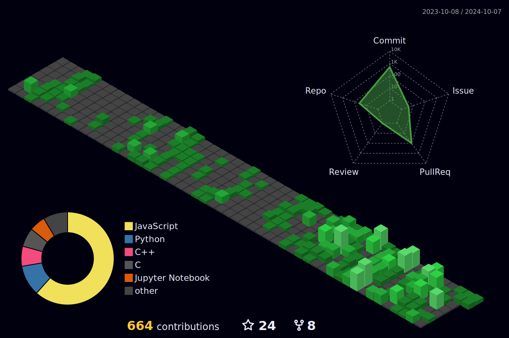

  

- 📫 How to reach me **sanchiitvijay@gmail.com**

- 👨‍💻 All of my projects are available at [My Portfolio](https://sanchitvijay.vercel.app/)

- ⚡ Fun fact **One Piece is Real!!**

<h3 align="left">Connect with me:</h3>

<h3 align="left">Languages and Tools:</h3>

